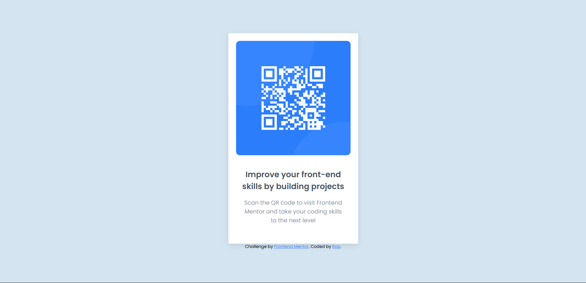

# Frontend Mentor - QR code component solution

This is a solution to the [QR code component challenge on Frontend Mentor](https://www.frontendmentor.io/challenges/qr-code-component-iux_sIO_H). Frontend Mentor challenges help you improve your coding skills by building realistic projects. 

## Table of contents

- [Overview](#overview)
  - [Screenshot](#screenshot)
  - [Links](#links)
- [My process](#my-process)
  - [Built with](#built-with)
  - [What I learned](#what-i-learned)
  - [Continued development](#continued-development)
  - [Useful resources](#useful-resources)
- [Author](#author)
- [Acknowledgments](#acknowledgments)

**Note: Delete this note and update the table of contents based on what sections you keep.**

## Overview

### Screenshot

### Links

- Solution URL: [Add solution URL here](https://your-solution-url.com)
- Live Site URL: [Add live site URL here](https://your-live-site-url.com)

## My process

### Built with

- Semantic HTML5 markup
- CSS custom properties
- Flexbox
- Mobile-first workflow

### What I learned
Thanks to the **QR card project**, I now have a clear understanding of when and how to use `margin`, `padding`, and `display: flex`. I had to refer to the documentation to fully grasp how `flex` works, but I’m confident that next time, I’ll be able to build layouts using `flex` without external guidance. Additionally, my understanding of the box model has improved, especially how `margin: auto auto` works.

### Continued development
After completeting this lessons, I got a chance to fill the gaps in my knowledge. I need to work on -
- HTML code semantics
- image related css
- `display : flex` and its properties

### Useful resources
- MDN docs

## Author

- Website - [rop](https://github.com/rop2024)
- Frontend Mentor - [@rop2024](https://www.frontendmentor.io/profile/rop2024)

